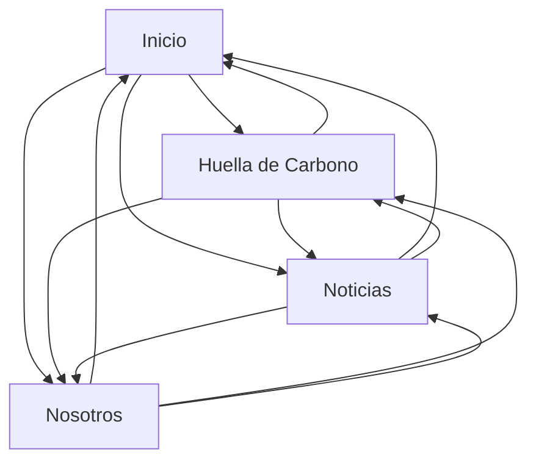

# The Blue Studio

Página web de un estudio de arquitectura desarrollada con HTML, CSS y JavaScript.

## Páginas maquetadas

* **Inicio (`index.html`)**: presentación de los proyectos actuales que son Horizonte, Elemental, Siliente y Tangente, además del header y footer.
* **Huella de Carbono (`huellaDeCarbono.html`)**: información sobre la sostenibilidad que lleva la empresa, materiales y el proyecto Esencia, el cual es el mas sustentable que se ha creado.
* **Noticias (`noticias.html`)**: sección de noticias y proyectos.
* **Nosotros (`nosotros.html`)**: información del estudio y sección de cifras destacadas.

## Componentes creados

* Header con navegación.
* Footer con links(no funcionales) a redes sociales, información legal e información de privacidad.
* Secciones de proyectos con imágenes y títulos.
* Bloques de noticias mediante el uso de Grid.
* Sección de cifras.
* Diseño responsive para adaptar la página a diferentes tamaños de pantalla.

## Cambios

* Se agrego apartados de información en la pagina Huella de carbono y Nostros.

## Navegación

